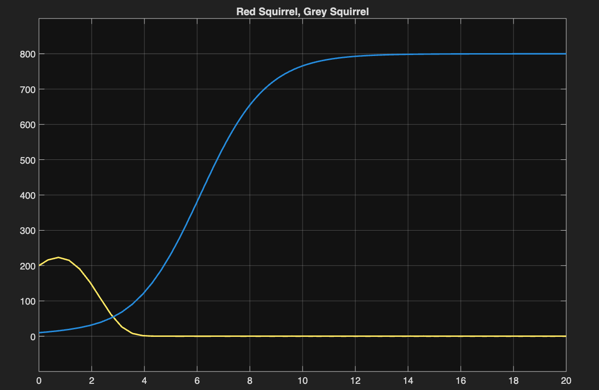
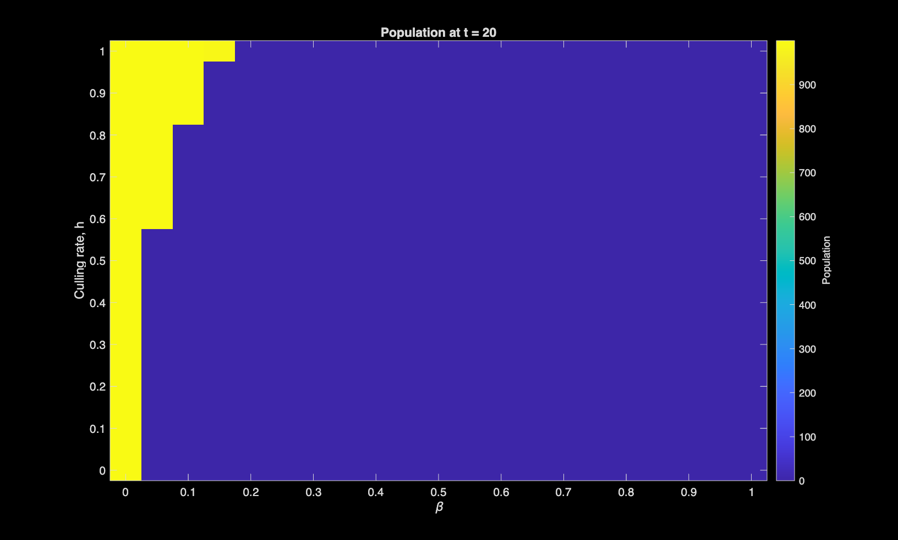
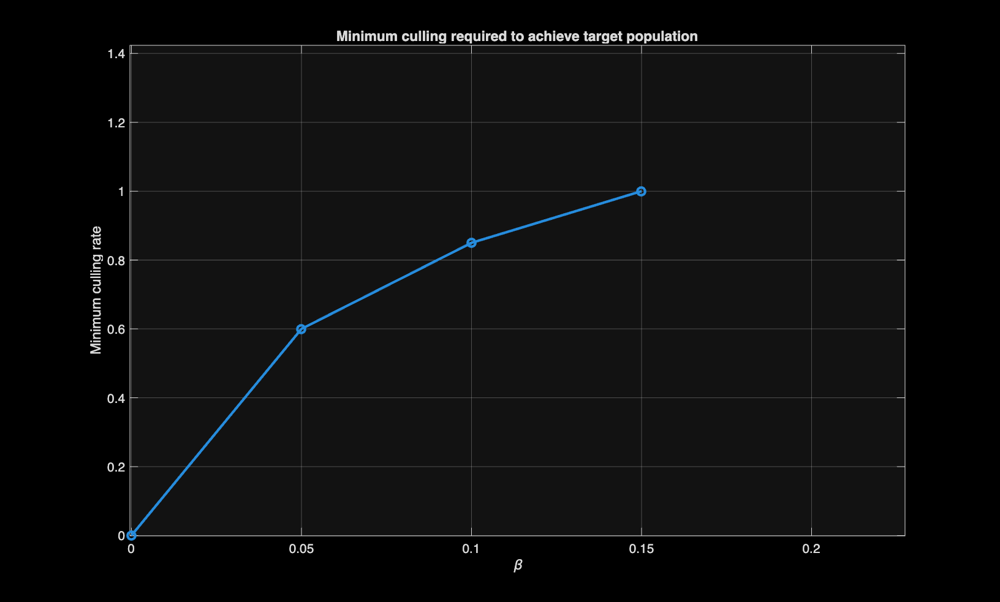

# Red-Squirrel-model
## A Mathematical Model of Red Squirrel Decline

This model investigates the decline of the UK red squirrel population. The main cause of decline is the squirrelpox virus, which is carried by grey squirrels but is lethal only to red squirrels. The model describes the populations of both species over time and investigates the effect of grey squirrel culling. In particular, it determines the culling coefficient ($h$) required to ensure the survival of the red squirrel for different virus transmission rates ($\beta$).

The model is based on the Lotka--Volterra equations with an added logistic growth term.

$$
\frac{dR}{dt} = \alpha R\left(1-\frac{R+G}{k}\right) - \beta RG
$$

$$
\frac{dG}{dt} = -\gamma G + \delta G\left(1-\frac{R+G}{k}\right)
$$

The initial populations are:

- Red squirrels: $R(0)=200$
- Grey squirrels: $G(0)=10$

The following parameters are used for all figures:

- $\alpha = 1$
- $\gamma = 0.2$
- $\delta = 1$
- $k = 1000$

### Population dynamics (β = 0.05)

*Population of the red and grey squirrels over time for β = 0.05.*

---

## Grey squirrel culling

A culling term h, is incorporated to the grey squirrel equation:

$$
\frac{dR}{dt} = \alpha R\left(1-\frac{R+G}{k}\right) - \beta RG
$$

$$
\frac{dG}{dt} = -(\gamma (1-h) + h) G + \delta G\left(1-\frac{R+G}{k}\right)
$$

### Population heatmap

*Red squirrel population after 20 time units for different combinations of virus transmission rate (β) and culling coefficient (h).*

---

### Effective culling coefficient

*Minimum culling coefficient required to ensure the survival of the red squirrel population for a given virus transmission rate ($\beta$). The line of best fit terminates at around β = 0.15, beyond which no feasible culling rate can prevent the extinction of the red squirrel population.*
